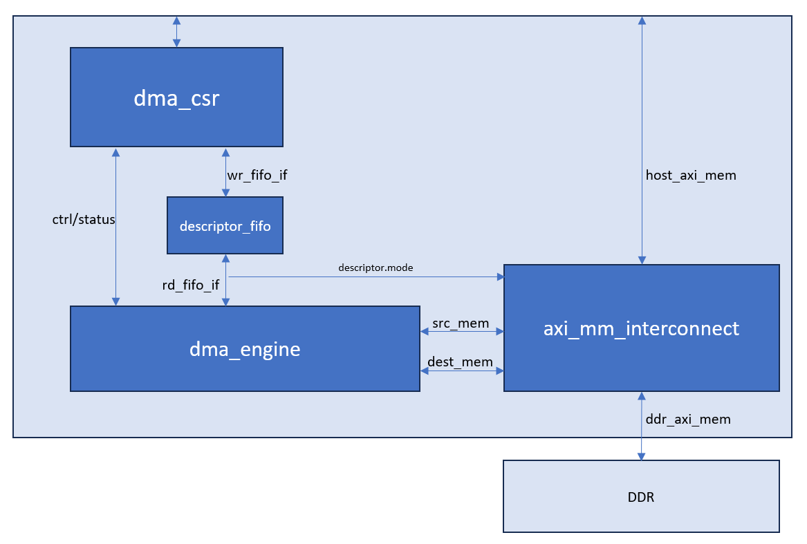
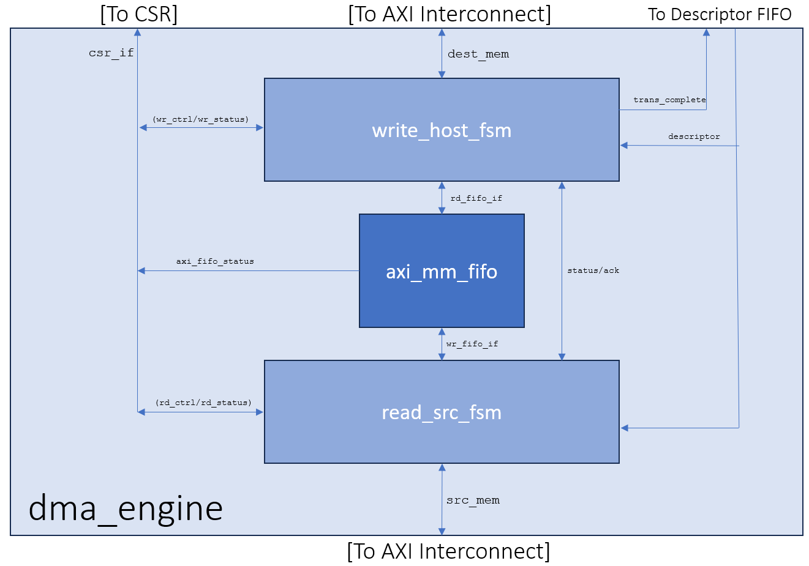

# DMA
## DMA Block Diagram

The direct memory access (DMA) AFU example shows how to manage memory transfers between the host processor and the FPGA without the need for processor intervention.  You can integrate the DMA AFU into your design to move data between the host memory and the FPGA local memory. The minimum and maximum supported size for each transfer is 64B and 2MB, respectively.



The DMA AFU comprises the following primary submodules:
- Control/Status Register (CSR) block
- Descriptor FIFO
- DMA Engine
- AXI-MM Interconnect Mux

DMA Top Level RTL Source Files:
- [ofs\_plat\_afu.sv](hw/rtl/ofs_plat_afu.sv) is nearly identical to [hello\_world](../hello_world/). The PIM transformation from the raw host channel to MMIO and host memory interfaces is here.
- [dma\_top.sv](hw/rtl/dma_top.sv) is instantiated by [ofs\_plat\_afu.sv](hw/rtl/ofs_plat_afu.sv) and comprises the aforementioned primary submodules.  It routes the PIMs AXI-lite interface to the CSR space and a pair of PIM-based AXI-MM interfaces to local memory and host memory. 
- [csr\_mgr.sv](hw/rtl/csr_mgr.sv) implements the CSR space that is exposed to the host with MMIO. Comments at the top describe all the registers, both status and control.
- [descriptor\_fifo](https://github.com/OFS/ofs-platform-afu-bbb/blob/master/plat_if_develop/ofs_plat_if/src/rtl/utils/prims/ofs_plat_prim_fifo_bram.sv) is a buffer of DMA descriptors to be loaded by software indirectly with MMIO writes to the CSR Space.  Each descriptor is then serviced by the [dma\_engine](hw/rtl/dma_engine.sv) in the order they are recieved.  Each descriptor contains a source address, destination address, length (in bytes) and control field.
- [dma\_axi\_mm\_mux.sv](hw/rtl/dma_axi_mm_mux.sv) is a simplified AXi-MM interconnect and is responsible for controlling which top-level AXI-MM interface acts as the source and destination for each DMA transaction. It consumes four unique AXI-MM interfaces: 
    - src\_mem: AXI-MM interface bus used for issuing read requests to the source memory (Host or DDR) specified by the descriptor control field (descriptor.descriptor\_control.mode).
    - dest\_mem: AXI-MM interface bus used for writing AXI bursts to the destination memory (Host or DDR) specified by the descriptor control field (descriptor.descriptor\_control.mode). 
    - ddr\_mem: AXI-MM interface connected to the PIM local memory (DDR)
    - host\_mem: AXI-MM interface connected to the PIM host memory through the FIU 
- [dma\_ddr\_selector.sv](hw/rtl/dma_ddr_selector.sv) is a simple AXI multiplexor that selects which of DDR interface to perform DMA transactions on.  

## DMA Engine Block Diagram
- [dma\_engine.sv](hw/rtl/dma_engine.sv) is responsible for servicing each DMA transaction with the information provided by the descriptors. It contains a read and write engine, with a data FIFO in between.  When a descriptor is committed, the read engine ([read\_src\_fsm.sv](hw/rtl/dma_read_engine.sv)) will use the information in the descriptors to issue a read request, where the read data is then written to the data FIFO. The write engine ([write\_dest\_fsm.sv](hw/rtl/dma_write_engine.sv)) will use the information in the descriptor to read the FIFO and write the data to the destination address. 


- [dma\_read\_engine.sv](hw/rtl/dma_read_engine.sv) is a finite state machine responsible for using the source address and length fields of the descriptor to issue a read request over AXI-MM.  Since the max burst size specified by the AXI is 256 (16kB), it will issue 16kB read request bursts until the data size requirement is met.  It then copies the data to a data FIFO so that it may be forwarded to the destination by the write engine.  
- [dma\_write\_engine.sv](hw/rtl/dma_write_engine.sv) is a finite state machine responsible for using the destination and length fields of the descriptor to issue a write request over AXI-MM. Similar to the read engine, it will issue 16kB write bursts until the data size requirement is met.

## Supplimentary Hardware RTL files
- [dma\_csr\_if.sv](hw/rtl/dma_csr_if.sv) is an interface file used for connecting to the CSR space.
- [dma\_pkg.sv](hw/rtl/dma_pkg.sv) is a package file used for keeping all of the data structures and parameters for the DMA Core

## Software Application
The software demonstrates the same OPAE capabilities as previous examples to initiate a DMA transaction.  

```bash
# --transfer-size: Initiating a DMA transfer with bytes 
#                        Minimum = 64 
#                        Maximum = 2097152
./dma --transfer-size=16384
```

This example shows how to initiate a 16kB DMA transfer.

Huge pages requirement for this test:
  - More than 32, 2MB huge pages need to be setup
